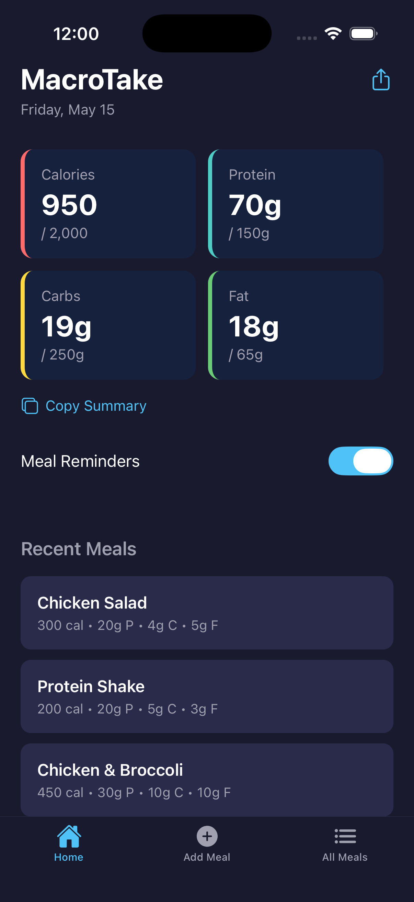

# MacroTake

**MacroTake** is a mobile app that allows users to log their daily meals and track their macros (calories, carbs, protein, fat) efficiently.



## Features
- Meal intake form
- View daily totals for calories, protein, carbs, and fat
- View recently or all logged meals 
- Share and copy meal data
- Haptic feedback
- Daily meal reminder notifications for iOS
- Local data persistance
- Tab-based navigation

## Screen Functionality
- Home Screen: Displays user's daily macro intake progress and recently logged meals
- Add Meal Screen: Form that allows users to log a meal for the current day
- All Meals Screen: Displays all of the user's logged meals

## Tech Stack
- React Native
- Expo (SDK 55)
- TypeScript
- AsyncStorage

## Setup

1. Clone the repository
   ```bash
   git clone https://github.com/Anthony-Jerez/MacroTake.git
   cd MacroTake
   ```

2. Install dependencies

   ```bash
   npm install
   ```

3. Start the app

   ```bash
   npx expo start
   ```

In the output, you'll find options to open the app in a

- [development build](https://docs.expo.dev/develop/development-builds/introduction/)
- [Android emulator](https://docs.expo.dev/workflow/android-studio-emulator/)
- [iOS simulator](https://docs.expo.dev/workflow/ios-simulator/)
- [Expo Go](https://expo.dev/go), a limited sandbox for trying out app development with Expo
